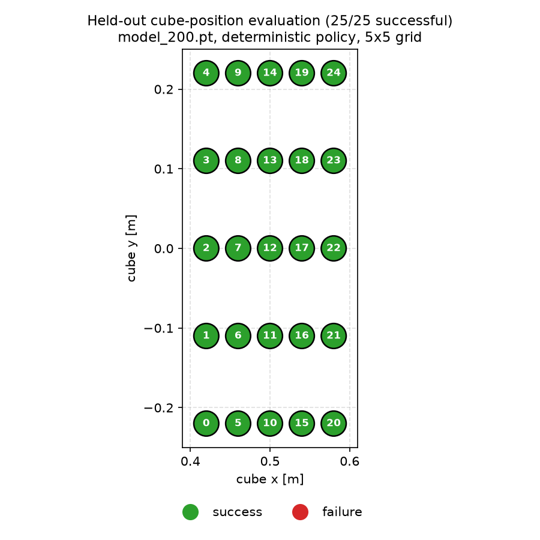
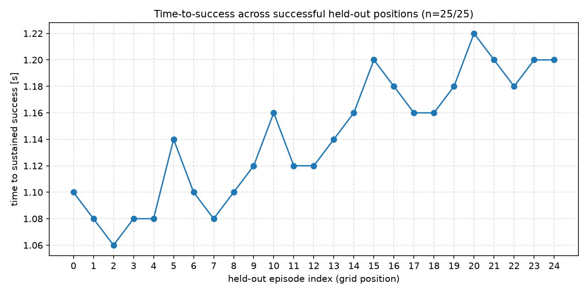
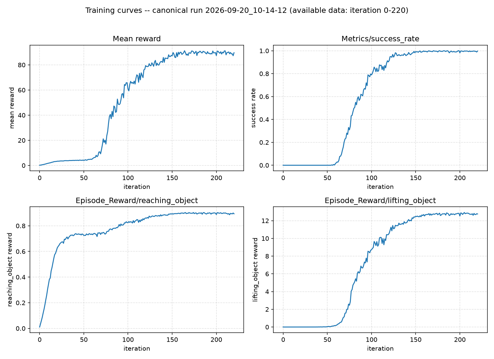
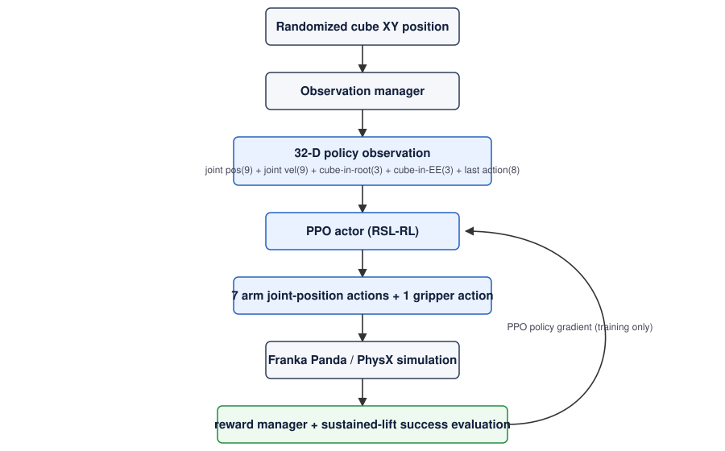

# Franka Cube Pick-and-Lift with PPO in Isaac Lab

A Franka Panda arm learns, entirely in simulation, to reach a cube at a randomized table position,
grasp it, lift it, and hold it above a sustained-success height — trained with PPO (RSL-RL) inside
a custom external Isaac Lab `ManagerBasedRLEnv` task.

## Results

Measured on the canonical checkpoint (`model_200.pt`, run `2026-09-20_10-14-12`), evaluated
deterministically on a held-out 5×5 grid of cube positions never seen during training:

| Metric | Value |
|---|---|
| Held-out success rate | **25 / 25 (100%)** |
| Object drops | 0 |
| Mean time to sustained success | 1.1408 s |
| Median time to sustained success | 1.1400 s |
| Time-to-success range | 1.06 – 1.22 s |
| Mean max cube height reached | 0.9645 m |
| First training success | iteration 55 |
| ≥90% training success rate | iteration 118 |
| Training success rate at `model_200` | 98.21% |







## Problem / motivation

The goal is to train a Franka Panda, entirely in simulation, to take a cube at a randomized XY
position on a table through the full pipeline:

```
randomized cube pose → reach → grasp → lift → sustain above success height
```

This is a custom, external Isaac Lab project (`ManagerBasedRLEnv`), not a modification of any
built-in Isaac Lab task, and not a tutorial project — the task, reward design, observation set, and
evaluation protocol were all engineered and independently verified for this repository. This
project makes no sim-to-real claim; it is evaluated entirely within simulation.

## System architecture



Randomized cube state feeds the observation manager, which produces a 32-D policy observation
consumed by a PPO actor. The actor outputs 7 arm joint-position actions and 1 gripper action, which
drive the Franka Panda through Isaac Lab's PhysX simulation. The reward manager and a
sustained-lift success evaluator read back simulator state each step; during training the resulting
return feeds a PPO policy-gradient update back into the actor.

## Observations (32-D)

| Observation | Dim |
|---|---|
| Joint positions (relative to default pose) | 9 |
| Joint velocities (relative) | 9 |
| Cube position in robot-root frame | 3 |
| Cube position in end-effector frame | 3 |
| Previous action | 8 |
| **Total** | **32** |

The end-effector-relative cube position is included because it exposes task-relevant geometry
(distance and direction from the gripper to the cube) directly to the policy, rather than requiring
it to be inferred indirectly from base-relative position plus joint angles. It is included alongside
the base-frame cube position, not in place of it.

## Actions (8-D)

- 7 arm joint-position actions.
- 1 binary gripper action using Isaac Lab's validated `BinaryJointPositionActionCfg`:
  `raw < 0` → CLOSE, `raw >= 0` → OPEN.

The production system deliberately uses this standard binary gripper representation rather than a
custom actuator mapping — a control comparison against Isaac Lab's own official Franka lift task,
which uses the same binary action term and learns the task successfully, confirmed the binary
representation is not a limiting factor here.

## Reward design

| Term | Purpose | Weight |
|---|---|---|
| `reaching_object` | Dense shaping toward the cube (tanh distance kernel) | 1.0 |
| `lift_progress` | Dense shaping toward the success height, relative to the cube's calibrated resting height | 5.0 |
| `lifting_object` | Binary bonus once the cube clears a low lift threshold | 15.0 |
| `lift_success` | One-shot bonus + metrics logger for sustained-lift success | 10.0 |
| `action_rate` | Regularizer discouraging jittery actions | -0.0001 |
| `joint_vel` | Regularizer discouraging high joint velocities | -0.0001 |

Physical constants used by these terms:

- settled cube rest height: `0.021 m` (measured empirically, not assumed)
- lift shaping threshold (`lifting_object`): `0.061 m`
- sustained-success height: `0.15 m`
- sustained-success hold duration: `25` consecutive control steps

There is no dedicated gripper-timing reward term. An earlier design included two such terms;
they were removed because they actively biased the policy toward a fixed gripper action rather
than helping it — see *Key engineering findings* below. Gripper timing in the current system
emerges instrumentally from the reach/lift objective alone.

## Training

- Algorithm: PPO via RSL-RL.
- 4096 parallel environments, 24 rollout steps per environment per iteration.
- Actor and critic: MLP, hidden dims `[256, 128, 64]`, ELU activations.
- Gaussian action distribution, `std_type="scalar"` (framework default).
- The canonical checkpoint (`model_200.pt`) reflects 19,660,800 environment transitions
  (4096 × 24 × 200) — training success was already well-established by iteration 200; the run was
  not required to reach the full configured iteration budget to produce this checkpoint.

## Evaluation

Held-out evaluation uses a fixed, non-random 5×5 grid of cube XY positions, distinct from the
uniform-random distribution sampled during training:

- X: `0.42, 0.46, 0.50, 0.54, 0.58`
- Y: `-0.22, -0.11, 0.00, 0.11, 0.22`
- 25 cartesian positions total, seed `0`, fully deterministic policy (mean action, never sampled).

Success is defined as: cube world `z >= 0.15 m`, sustained for 25 consecutive control steps —
judged purely from simulator state, never from reward values.

Results: **25/25 (100%)**, 0 drops, mean time-to-success 1.1408 s, median 1.1400 s, range
1.06–1.22 s. Full per-position data: `results/held_out_eval/held_out_results.csv` and
`results/held_out_eval/summary.json`.

## Key engineering findings

- Reward calibration must use the object's *measured* resting height, not an assumed world-z
  origin — using the raw spawn height instead handed out reward for doing nothing.
- Small-scale diagnostic runs (tens of parallel environments) were useful for fast iteration during
  debugging but were not representative of behavior at the training scale that actually solves the
  task; several findings from small-scale runs did not hold at full scale.
- Hand-designed gripper-timing reward terms, added to fix an early "gripper never closes" failure
  mode, instead produced a global action bias that the policy could not escape. Removing them
  entirely, and letting gripper timing emerge instrumentally from the reach/lift objective, is what
  actually solved the task.
- Comparing against Isaac Lab's own official Franka lift task (unmodified, same binary gripper
  action, same PPO algorithm) was critical for separating problems specific to this project's MDP
  design from potential simulator/framework issues — the official baseline's success confirmed the
  underlying platform was not the obstacle.

## Installation / runtime

Tested configuration:

- Ubuntu 24.04
- Isaac Lab v3.0.0-beta2.patch1
- Isaac Sim 6.0.1.0
- PyTorch 2.10.0+cu128
- RSL-RL 5.0.1

This project uses two separate Python virtual environments: `env_isaaclab` (Isaac Lab itself) and
`env_isaacsim` (Isaac Sim's own pip package, which does not live inside `env_isaaclab` for this
setup). `scripts/run.sh` adds `env_isaacsim`'s site-packages to `PYTHONPATH` for a single
invocation only — it does not modify either virtual environment or any shell startup file, and
`PYTHONPATH` should not be persisted into `.bashrc` or similar.

The Franka asset's default path (resolved via Isaac Lab's `ISAAC_NUCLEUS_DIR`) currently 404s
against the live content server for this Isaac Lab revision; this project points its own copy of
the robot config at a verified `Legacy/panda_instanceable.usd` path instead
(`FRANKA_PANDA_LEGACY_USD_PATH` in the env cfg), without modifying the upstream
`isaaclab_assets.FRANKA_PANDA_CFG`.

```bash
# install (from the env_isaaclab Python)
/home/<user>/env_isaaclab/bin/python -m pip install -e source/franka_pick_lift_rl
```

## Commands

```bash
# random-action smoke test (headless flag bounds it externally with `timeout`, since it
# otherwise runs until a visualizer window is closed)
timeout 60 scripts/run.sh scripts/random_agent.py --task Franka-PickLift-Cube-v0 --num_envs 8 --viz none --headless

# training
scripts/run.sh scripts/rsl_rl/train.py --task Franka-PickLift-Cube-v0 --num_envs 4096 --headless --max_iterations 1500

# deterministic playback of a trained checkpoint
scripts/run.sh scripts/rsl_rl/play.py --task Franka-PickLift-Cube-v0 --num_envs 8 --headless --checkpoint <checkpoint-path>

# held-out evaluation (25-position deterministic grid)
scripts/run.sh scripts/evaluate.py --checkpoint <checkpoint-path> --headless
```

## Limitations

- Simulation only; no real-robot deployment or sim-to-real validation of any kind.
- Privileged state observations (joint state, direct object pose) — no camera/vision perception.
- Fixed cube mass, friction, and dynamics; fixed robot and object identity.
- Only the cube's initial XY position is randomized — no broader domain randomization.
- Requires the Legacy Franka asset-path workaround described above for this tested local revision.
- A rare, non-deterministic RSL-RL training crash
  (`RuntimeError: normal expects all elements of std >= 0.0`) was observed in some extended
  post-convergence training attempts. Root cause was not fully isolated; periodic checkpointing
  provides a practical recovery, and the checkpoint evaluated above is unaffected by it.

## Checkpoints and results

Training logs, TensorBoard event files, and model checkpoints (`logs/`) are not committed to this
repository — see `.gitignore`. Evaluation results (`results/held_out_eval/`,
`results/training_curves/`) *are* committed, since they are the evidence this README reports on.
To reproduce a checkpoint, run training as above; `<checkpoint-path>` in the commands section
refers to a `model_N.pt` file produced by that run.
